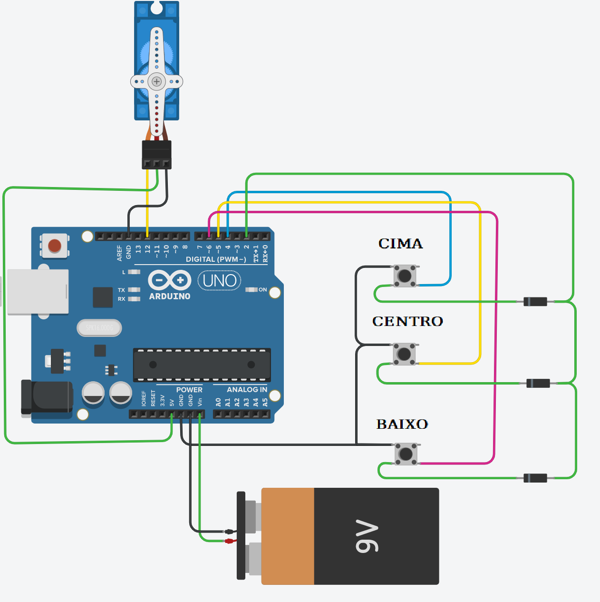
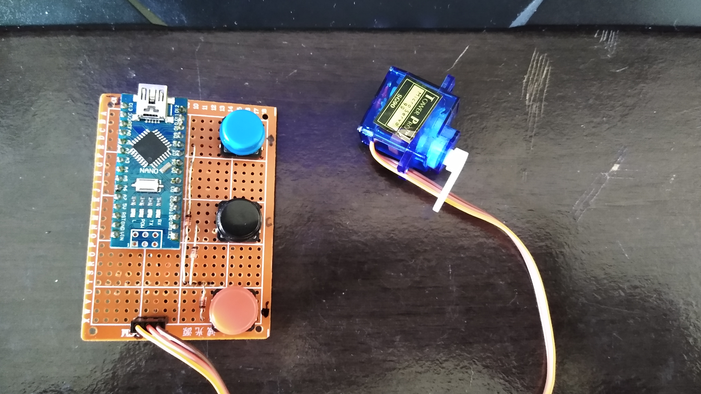
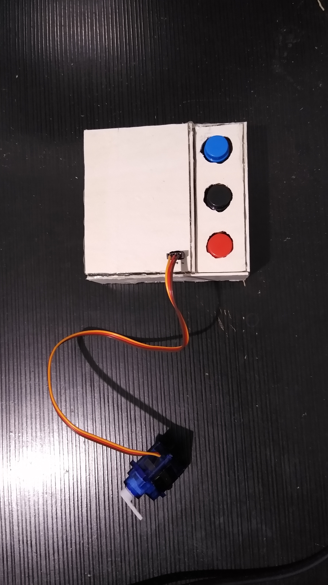

# Controlador Fluxo de Torneira 180°

Projeto para resolução de um problema particular... uma torneira com o controle de fluxo "frouxo" que será controlado através de três botões.

Os botões **Cima** e para **Baixo** movimentam a torneira de 0 a 180 graus e de 180 a 0 respectivamente.

O botão **Centro** retorna a torneira à posição central de 90 graus.

O circuito conta com o **Sleep Mode** do Arduíno, e para este funcionamento adicional é utilizado o pino **D2** (pode ser utilizado apenas os pinos **D2** e **D3** para uma interrupção externa. 

Código pode ser praticamente todo configurado através dos **#define**s no início do código.

## Hardware:

- 1 Arduino Nano
- 3 botões push button
- 3 diodos 1N4148
- 1 servo motor Micro SG90

## Pinout (Arduino):
- Servo motor: D12
- Botões:
-   Cima: D4
-   Centro D5
-   Baixo D6

## Circuito
 *Obs: o circuito original é feito com o Arduino NANO, mas a pinagem é a mesma.*

## Fotos

## Demonstração da economia de energia com o modo Sleep
- Por volta de 60mA em funcionamento
- Por volta de 8ma a 10ma quando entra em sleep
- Por volta de 5ma em modo sleep_cpu (retirando o led de indicação de energia (vermelho) do arduíno).
- *com o led de indicação a corrente ficaria por volta dos 8mA*

